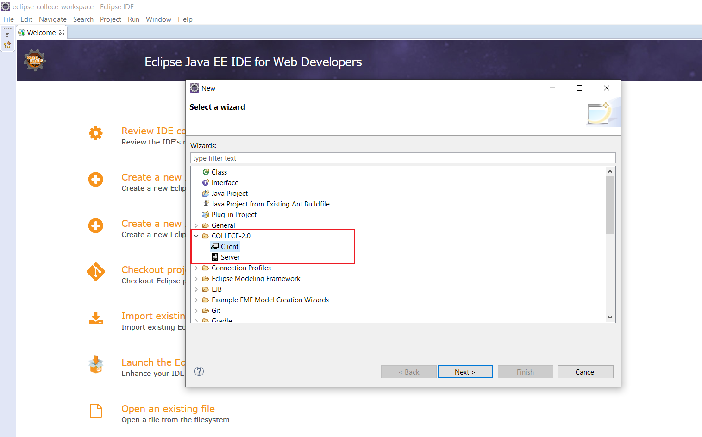
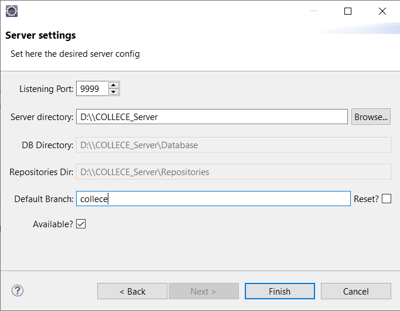
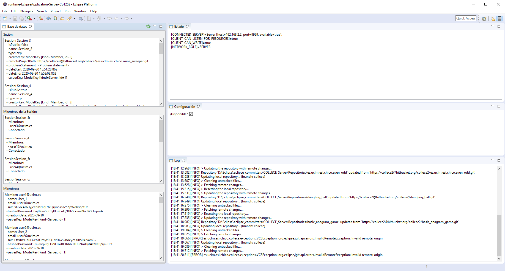
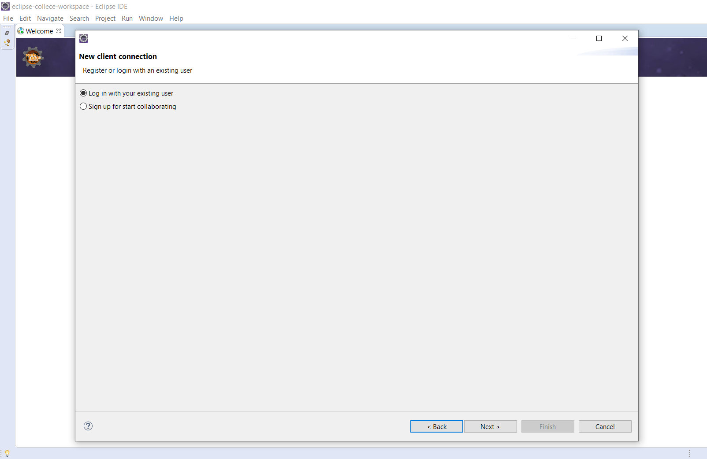
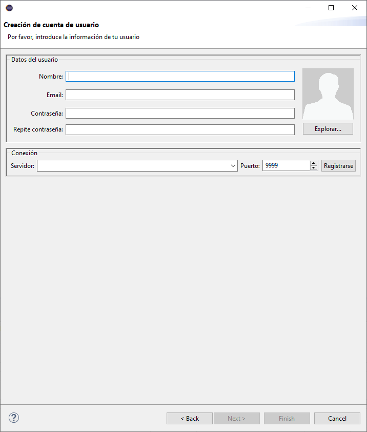
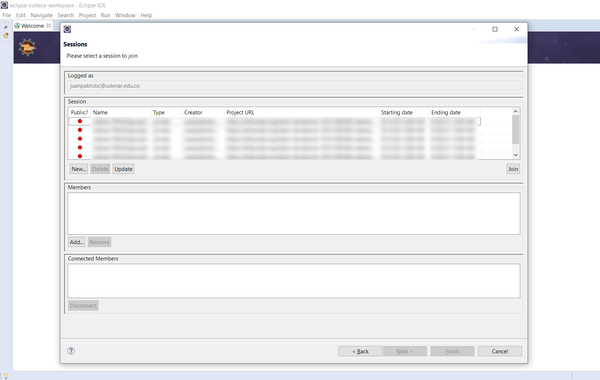
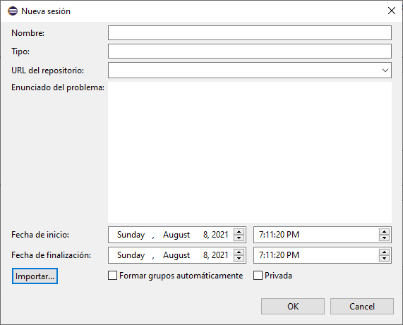
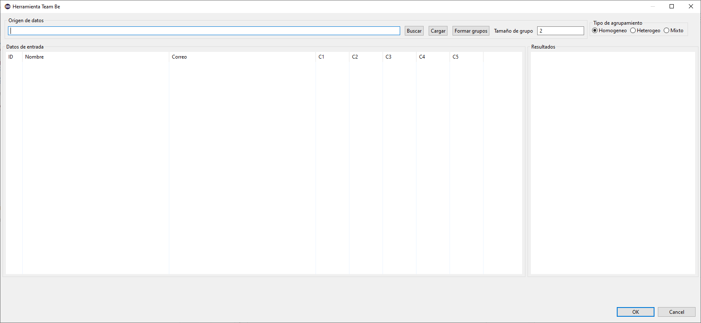

[Go to home](/README.md)

You can also [view this page in spanish](/CREATE_SESSIONS_ES.md)

---

# How to create sessions in Collece 2.0 using TeamBE

Here you will learn to create sessions in Collece 2.0 server instances using the TEAM-BE automatic group formation tool.

## Server instance

To get started go to  **File &rarr; New &rarr; Other**. Then select **COLLECE-2.0  &rarr; Server**



Now, input the server parameters. For most cases, the default ones are enough.



Press ***Finish*** and the server will start as shown in the following image: 



## Client instance

From another Eclipse instance, go to  **File &rarr; New &rarr; Other**, then select **COLLECE-2.0  &rarr; Client** and click on ***Next***. Then you can log-in into an existing account or create a new one.



To create a new account input the required data including the server's URL or IP and click on ***Sign up***



Press ***Next*** and you will see the list of sessions. To create a new one click on ***New...***



Now, input the required data, remember to check the ***Automatic group formation*** field. You can also import the data using a *yml* file.



The *yml* file must have some specific fields, here is an example:
```yml
name: TeamBE Demo Sesion
type: private
problem-statement: This is a test statement (you can use HTML code here)
date-start: 2021-02-01T00:00:00COT
date-end: 2025-03-30T00:00:00COT
teambe-enabled: true
private: 
```

When you press ***OK*** the main interface of TEAM-BE is opened. There you can input the participant's data from a CSV file, choose the grouping type and input the desired group size.



The correct order to form groups is this:
* Load the CSV file
* Select the grouping type and the group size
* Click on ***Load***
* Click on ***Shape teams***
* [Optional] Export the groups to a PDF file
* Click on ***OK*** to start the session creation process and its corresponding GIT repositories

When the process finishes, all the sessions for each groups will be available so the participants can join them following the [join sessions tutorial](/JOIN_SESSIONS.md).