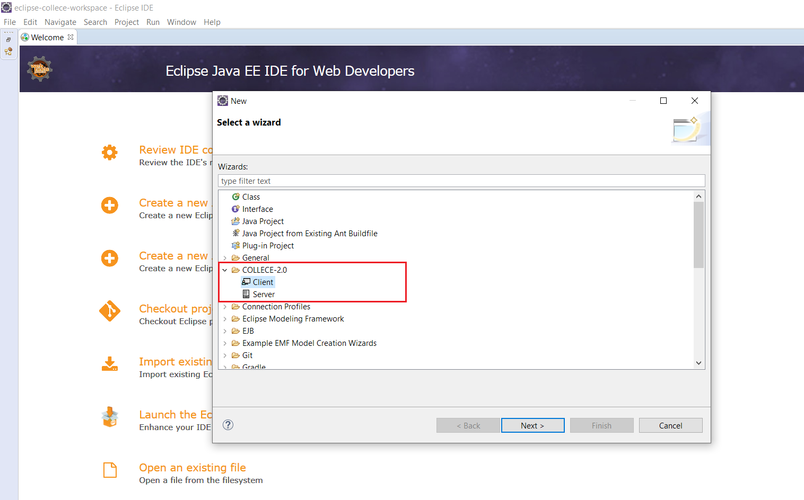

[Ir al inicio](/README_ES.md)

También puede [ver esta página en inglés](/CREATE_SESSIONS.md)

--

# Manual de creación de sesiones en Collece 2.0

A continuación se indica como crear sesiones en la instancia de servidor de Collece 2.0 utilizando la herramienta de formación automática de grupos TEAM-BE

## Instancia servidor

Para iniciar vaya a **File &rarr; New &rarr; Other**. Luego seleccione **COLLECE-2.0  &rarr; Server**



A continuación, ingrese los parámetros para el servidor. Para la mayoria de casos los ajustes por defecto son suficientes.


Presione ***Finish*** y el servidor se iniciará como se indica en la siguiente imagen:


## Instancia cliente

Desde otra instancia de Eclipse vaya a **File &rarr; New &rarr; Other**, luego seleccione **COLLECE-2.0  &rarr; Client** y haga click en ***Next***. Luego inicie sesión en una cuenta existente o cree una nueva.


Para crear una nueva cuenta ingrese los datos requeridos incluyendo la url o IP de la instancia servidor y haga click en ***Registrarse***


Presione ***Next*** y verá la lista de sesiones existentes en el servidor. Para crear sesiones nuevas haga click en ***New...***


A continuación ingrese los datos requeridos, recuerde marcar el campo ***Formar grupos automáticamente***. También puede importar los ajustes desde un archivo *yml*


El archivo *yml* debe tener ciertos campos específicos. A continuación se muestra un ejemplo:
```yml
name: TeamBE Demo Sesion
type: private
problem-statement: Este es un enunciado de prueba (puede usar código HTML)
date-start: 2021-02-01T00:00:00COT
date-end: 2025-03-30T00:00:00COT
teambe-enabled: true
private: true
```

Al presionar ***OK*** se abre la interfaz principal de TEAM-BE donde puede ingresar los datos de los participantes en desde un archivo CSV, escoger el tipo de agrupamiento e ingresar el tamaño del grupo.


El orden correcto para formar los grupos es el siguiente:

* Cargar el archivo CVS
* Seleccionar el tipo de agrupamiento e ingresar el tamaño del grupo
* Hacer click en *Cargar*
* Hacer click en ***Formar grupos***
* [Opcional] Exportar los grupos a un archivo PDF
* Hacer click en ***OK*** para que inicie el proceso de creación de sesiones y sus correspondientes repositorios GIT.

Al finalizar este proceso las sesiones para cada grupo estarán creadas y disponibles, los participantes podrán unirse a ellas siguiendo los pasos del [tutorial para unirse a sesiones](/JOIN_SESSIONS_ES.md).