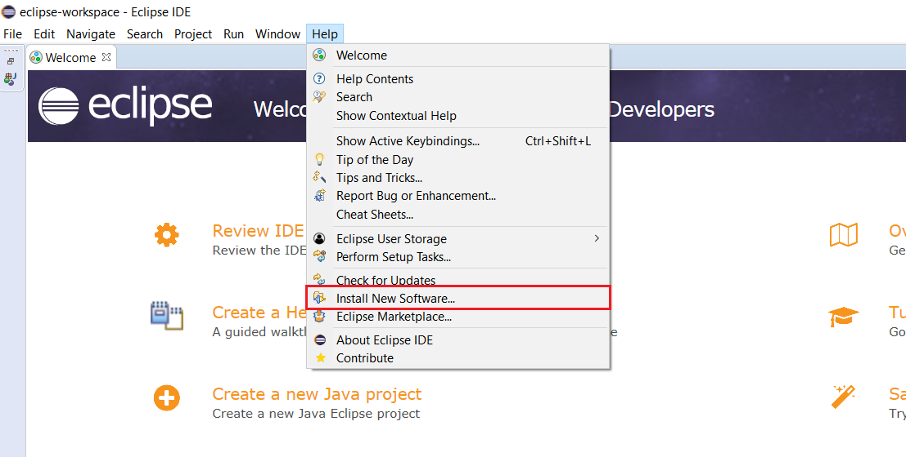
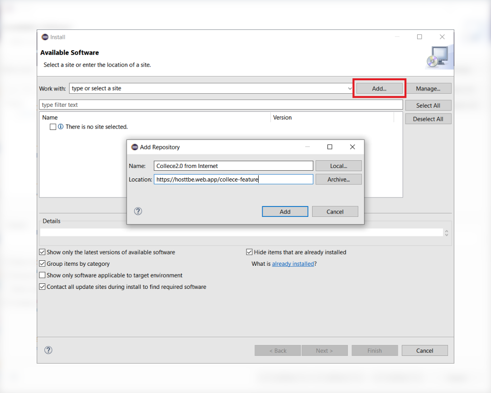
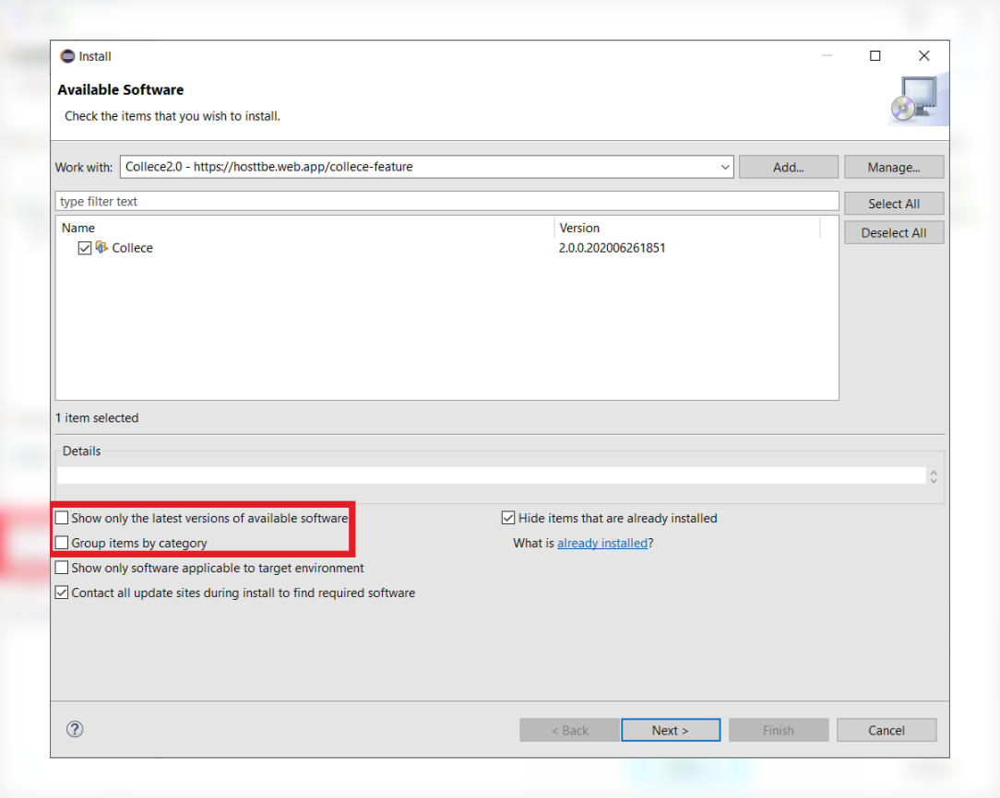
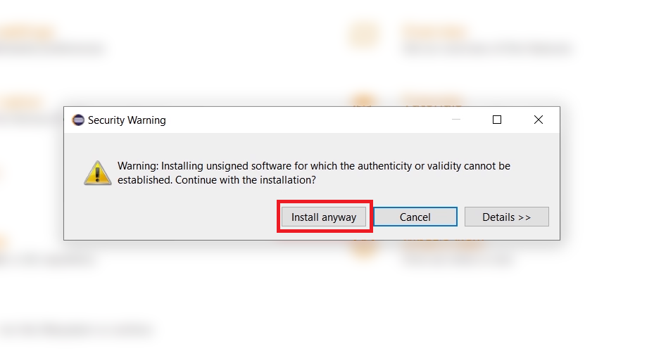
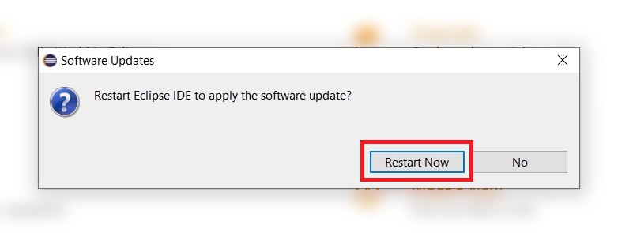
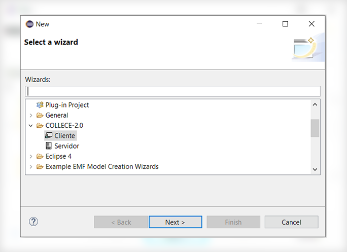

[Ir al inicio](/README_ES.md)

# Manual de instalación de Collece 2.0

## Instalación de Eclipse IDE

Descargue "Eclipse IDE for Java Developers" y realice la instalación normalmente. **Se recomienda usar la versión 2019‑03 R**. Puede acceder directamente a la página de descarga desde este [enlace](https://www.eclipse.org/downloads/packages/release/2019-03/r) 

## Instalación de Collece / TeamBE

Una vez instalado Eclipse vaya a:  **Ayuda &rarr; Instalar nuevo software**

**Haga click en el botón  "Add", luego llene los campos con la siguiente información**

| Name       | Location                                |
| ---------- | --------------------------------------- |
| Collece2.0 | https://hosttbe.web.app/collece-feature |

**Desmarque** las opciones **"Group items by category"** y **"Show only latest versions"** y marque Collece en la lista como se indica en la imagen: 

Luego continúe normalmente con el asistente de instalación, al instalarse puede mostrarse el siguiente cuadro de diálogo, simplemente haga click en ***Install anyway***

Cuando termine el proceso de instalación el asistente le preguntará si desea reiniciar el IDE para aplicar los cambios, seleccione ***Restart now***

Cuando el IDE se haya reiniciado puede verificar si Collece se instaló correctamente haciendo click en
***File &rarr; New &rarr; Other*** . Debería aparecer la categoría *COLLECE-2.0* como se observa en la imagen.

## Cómo unirse a sesiones de Collece

Para conectarse como un cliente de Collece vaya a ***File &rarr; New &rarr; Other*** y en la categoría *COLLECE-2.0* seleccione Cliente, el asistente le ayudará a unirse a la sesión que le corresponda.
