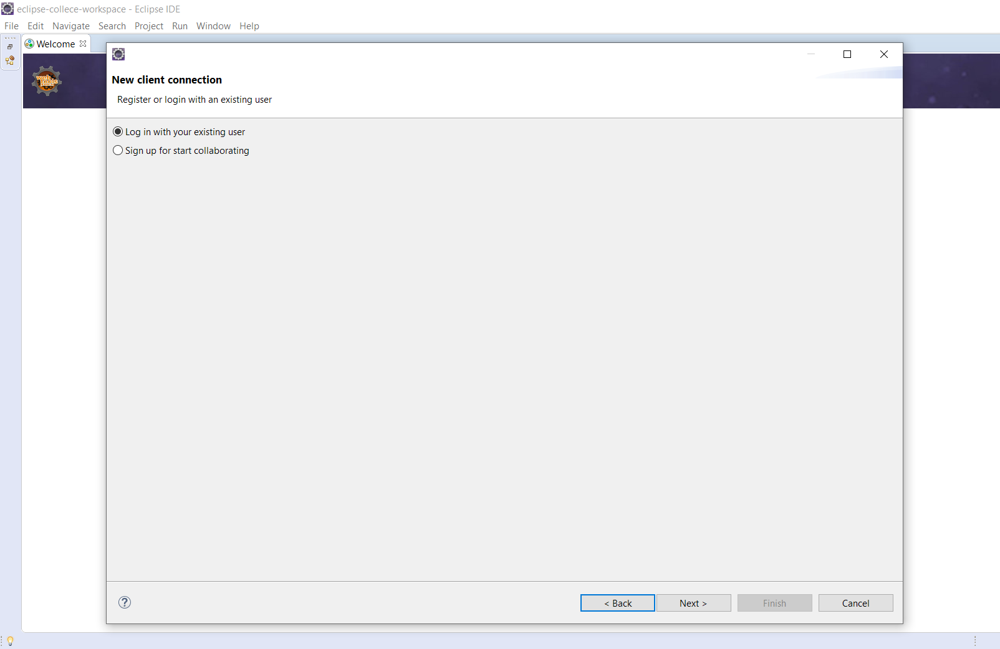

[Go to home](/README.md)

## How to join sessions in Collece 2.0 / TeamBE

To join a existing session go to **File** &rarr; **New** &rarr; **Other**

Then, in the **COLLECE 2.0** category select **Client**

Here you can create a new user or log-in with an existing one. If you already have a registered account click *Log in...* and next

Fill in the credential fields and the server, then click *Log in*, wait some few seconds and a message indicating success should appear.

Then, click on *Next* to see a list of the available sessions

Select a session and click *Join* **Keep in mind that you can only join sessions you belong to.** 
Then, a message should appear indicating that the log-in was sucessful.

Finally, click on *Finish*, wait a few seconds while Collece clones the corresponding repository

**NOTE:** By default, Eclipse shows a wellcome screen, to close it simply click the *x* next to Wellcome, so you can see the Collece's client perspective

If you followed this guide correctly, you should see the following user interface:

**NOTA:** If you close by mistake some of the Collece perspective windows, you can reopen them by clicking:  **Window &rarr; Perspective &rarr; Open perspective &rarr; Other ** y seleccione **Collece-2.0 (client)**
