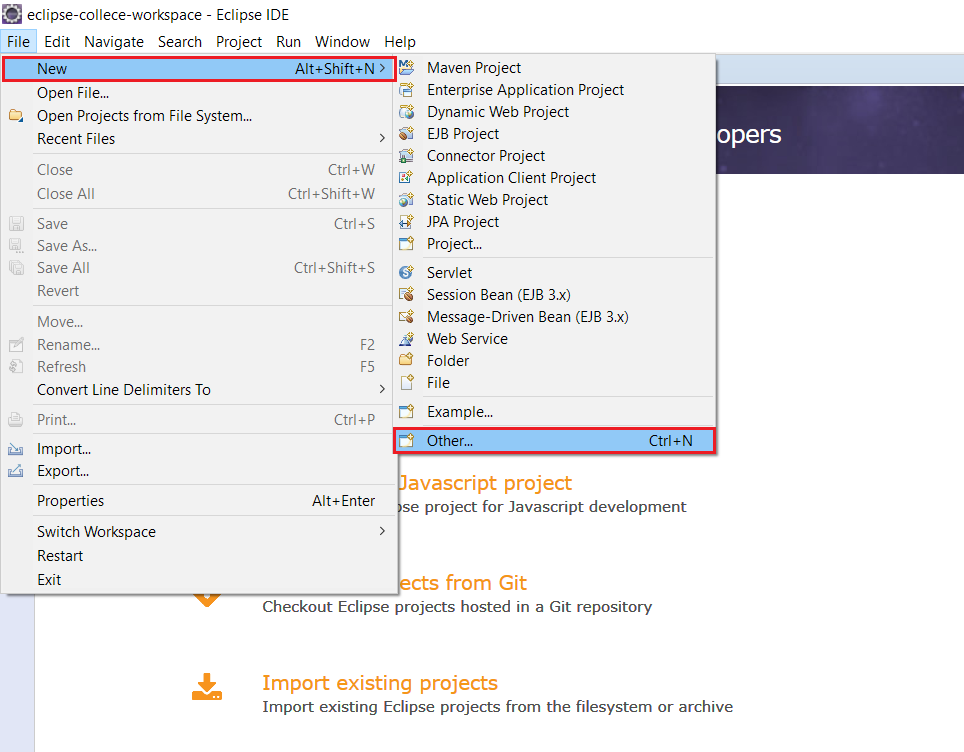
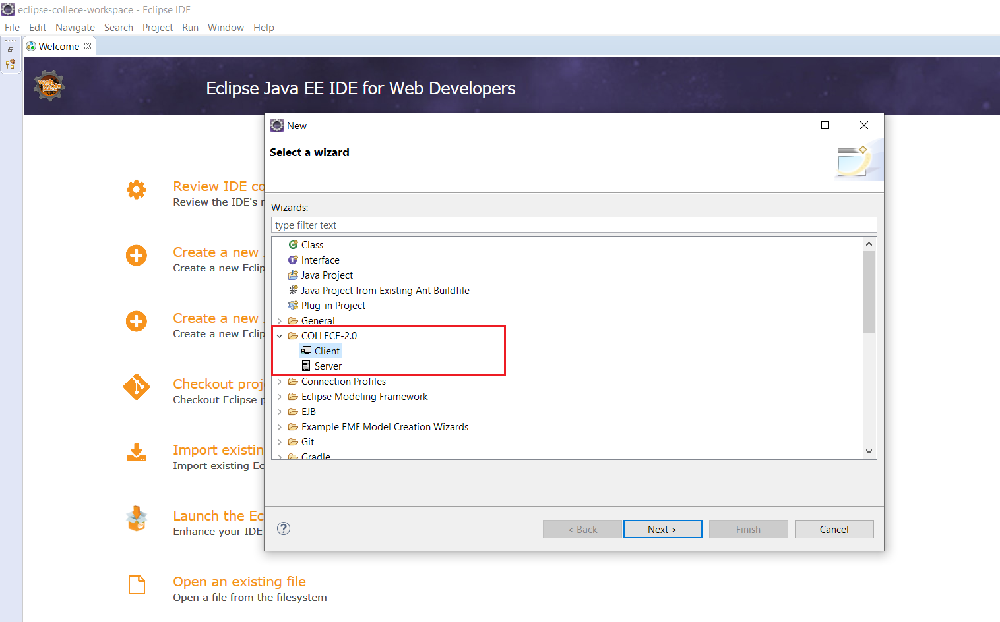
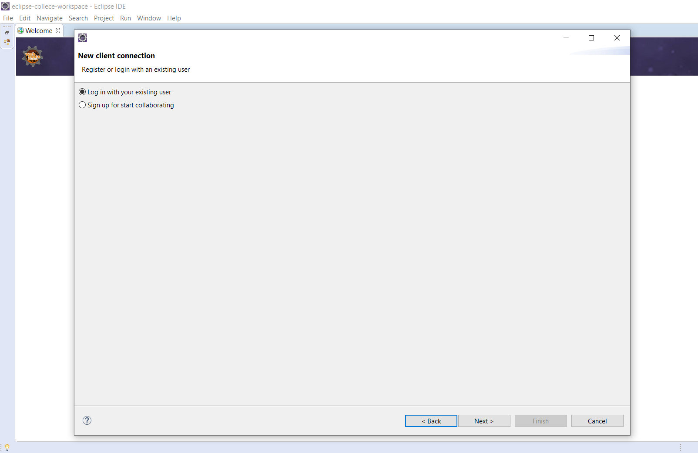
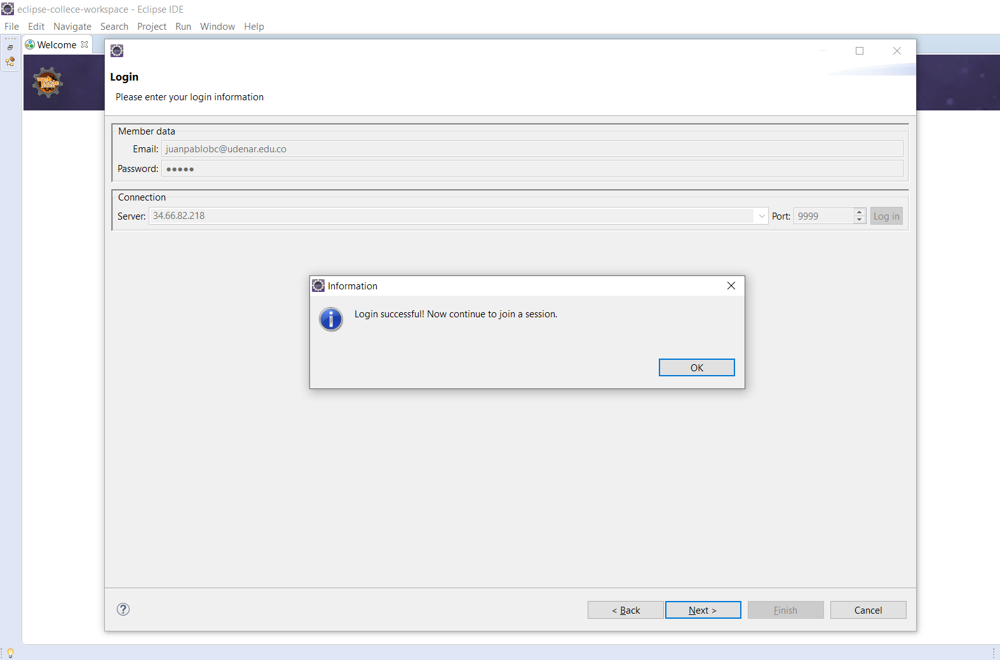
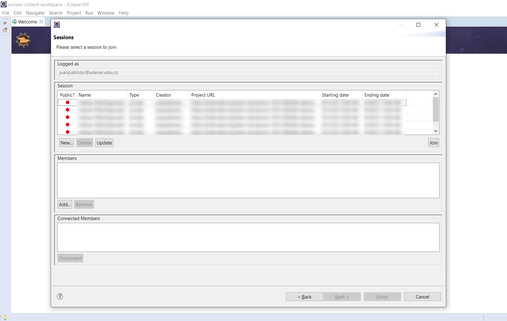
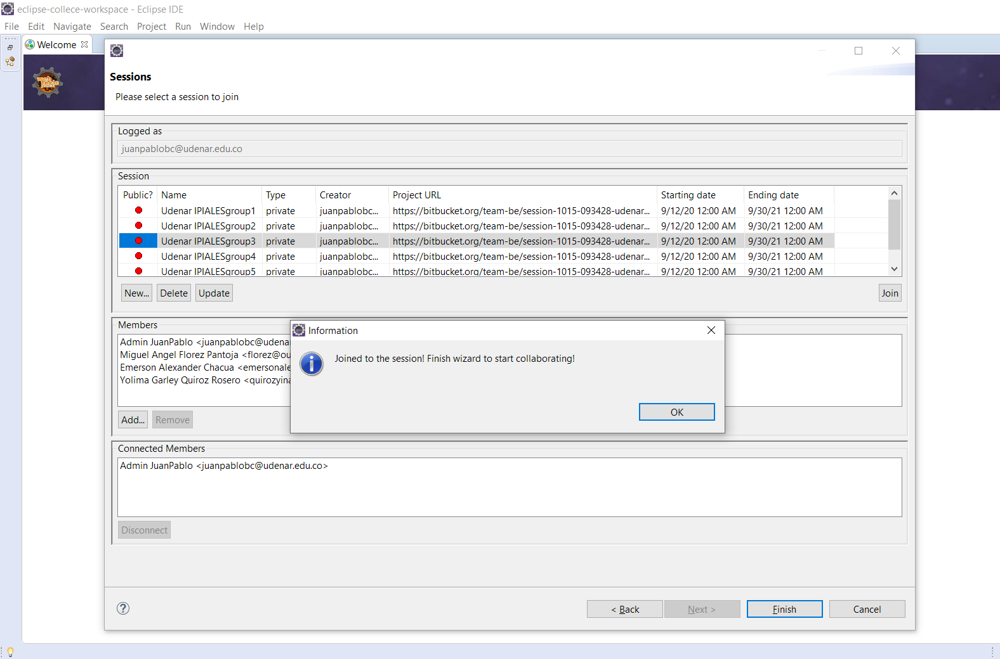
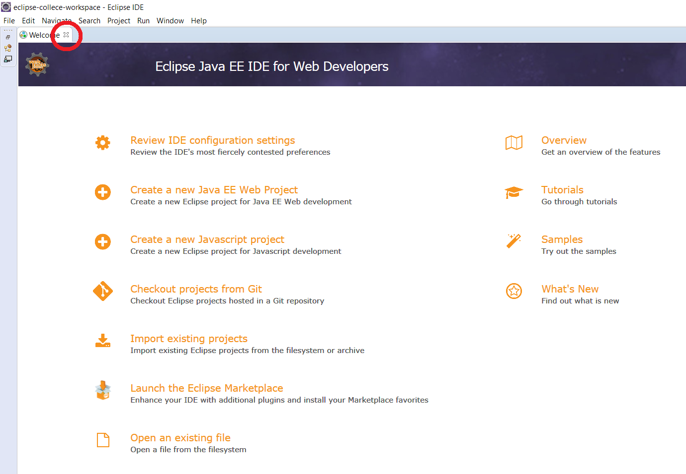
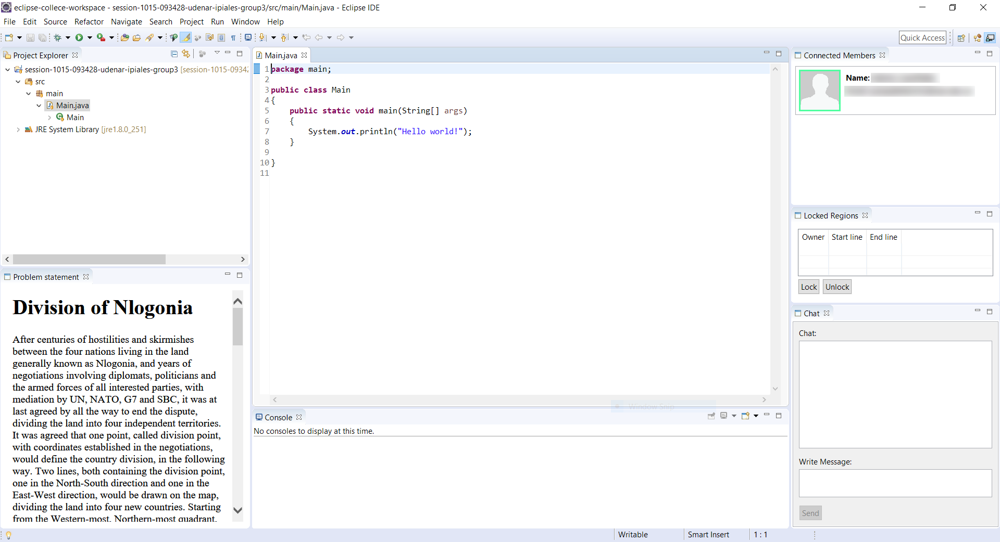

[Ir al inicio](/README_ES.md)

## Cómo unirse a sessiones de Collece 2.0 / TeamBE

Para unirse a una sesión creada previamente simplemente vaya a **File &rarr; New &rarr; Other **

Luego en la categoría **COLLECE 2.0** seleccione **Client**

Aquí puede crear un nuevo usuario o iniciar sesión con uno creado previamente. Si ya tiene un usuario creado seleccione *Log in...* y haga click en siguiente

Ingrese las credenciales proporcionadas y el servidor y haga clic en *Log in*, espere unos segundos y aparecerá un mensaje indicándole que el inicio de sesión fué exitoso

Después presione *Next* para ver el listado de sesiones disponibles

Seleccione la sessión que le corresponda y haga click en el botón *Join* **Tenga en cuenta que sólo podrá unirse a la sesión en la que esté registrado.** 
Una vez inicie sesión correctamtente aparecerá un mensaje indicando que se unió a la sesión con éxito.

Finalmente haga click en el botón *Finish*, espere unos segundos mientras Collece clona el repositorio correspondiente.

**NOTA:** Por defecto Eclipse muestra una pantalla de bienvenida, simplemente haga click en la *x* al lado de Wellcome para cerrarla y poder ver la perspectiva Cliente de Collece

Si realizó los pasos anteriores con éxito debería ver la siguiente interfaz:

**NOTA:** Si cierra por error alguna de las ventanas de la perspectiva Collece Cliente puede recuperarla  en:  **Window &rarr; Perspective &rarr; Open perspective &rarr; Other ** y seleccione **Collece-2.0 (client)**

