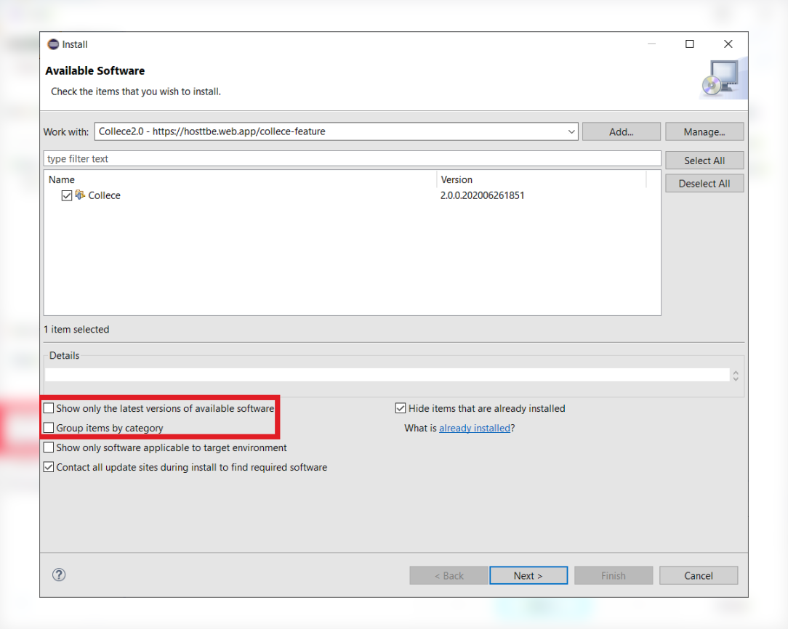
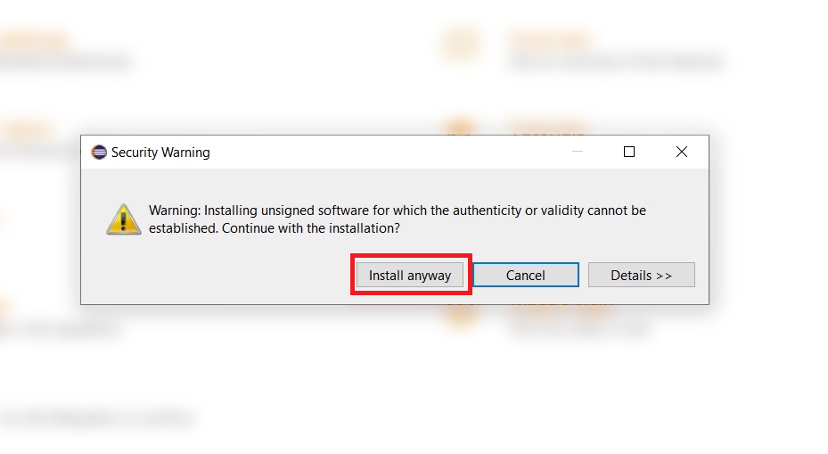
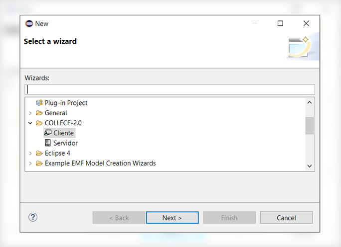

<<<<<<< HEAD
# TeamBE Tutorial

You can also [view this tutorial in spanish](https://gitlab.com/xCast/teambe-tutorials/-/blob/master/README_ES.md)

## Eclipse IDE Installation

Download "Eclipse IDE for Java Developers" and perform a normal installation. **Version 2019‑03 R is recommended**.

You can access downloads page from this [link](https://www.eclipse.org/downloads/packages/release/2019-03/r) 

## Collece / TeamBE Installation

In Eclipse IDE go to:  **Help &rarr; Install new Software**

**Click the "Add" button, then fill the fields with the following information**

| Name       | Location                                |
| ---------- | --------------------------------------- |
| Collece2.0 | https://hosttbe.web.app/collece-feature |

**Uncheck** the options **"Group items by category"** and **"Show only latest versions"** check Collece in the list as shown in the image: 

Then continue with normal installation, if the following dialog appears just click ***Install anyway***

When the process ends it will ask you to restart the IDE to apply changes, click ***Restart now***

Once restarted, you can check if Collece was properly installed clicking
***File &rarr; New &rarr; Other*** . The *COLLECE-2.0* should appear as shon in the image.

## How to join Collece sessions

To join a collece session go to ***File &rarr; New &rarr; Other*** and in the category *COLLECE-2.0* select Client, the wizard will help you join the session you belong to.