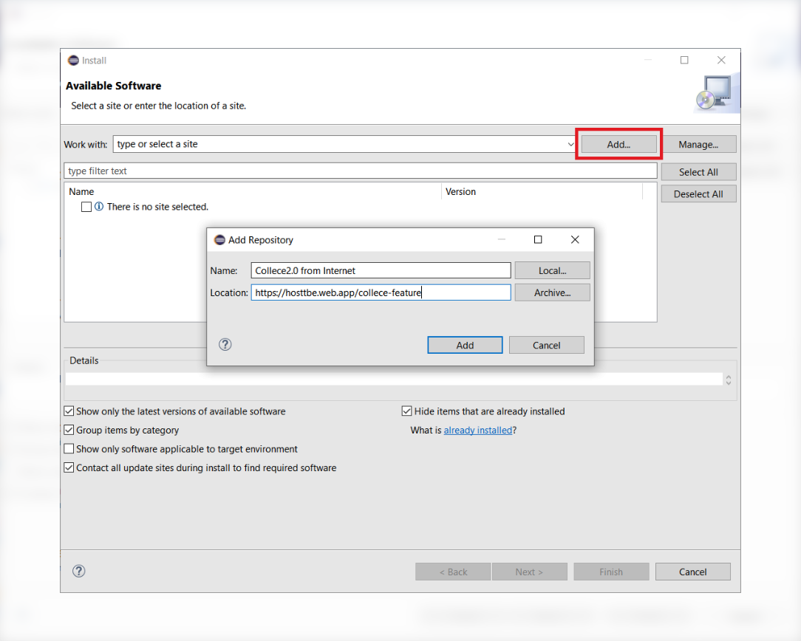

# TeamBE Tutorial

[View this tutorial spanish](https://gitlab.com/xCast/teambe-tutorials/-/blob/master/README_ES.md)

## Installation

In Eclipse IDE go to:  **Help &rarr; Install new Software**

**Click the "Add" button, then fill the fields with the following information**

| Name       | Location                                |
| ---------- | --------------------------------------- |
| Collece2.0 | https://hosttbe.web.app/collece-feature |

