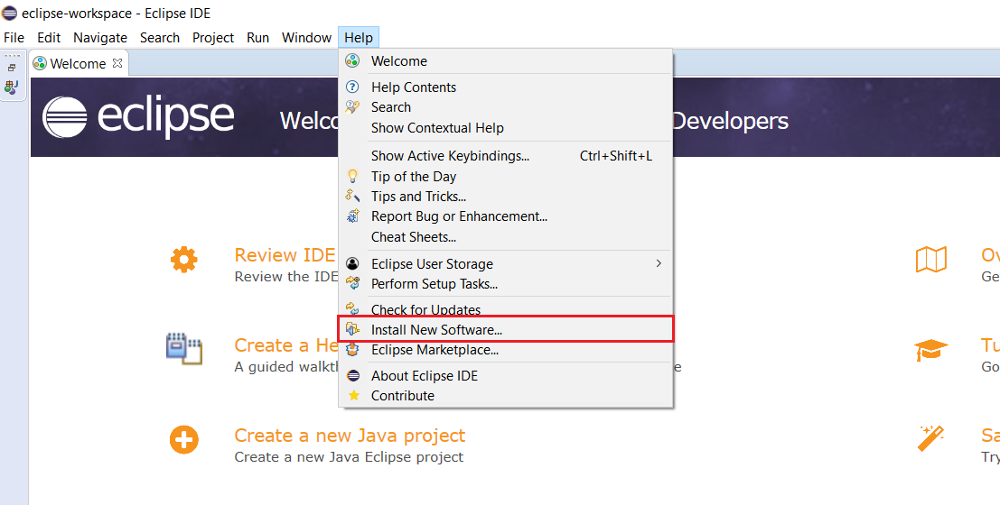
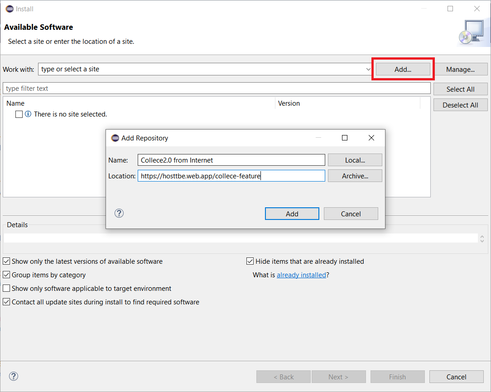

# Tutorial TeamBE

También puedes: [Ver este tutorial en inglés](https://gitlab.com/xCast/teambe-tutorials/-/blob/master/README.md)

## Instalación

En eclipse vaya a:  **Ayuda &rarr; Instalar nuevo software**

**Haga click en el botón  "Añadir", luego llene los campos con la siguiente información**

| Name       | Location                                |
| ---------- | --------------------------------------- |
| Collece2.0 | https://hosttbe.web.app/collece-feature |

